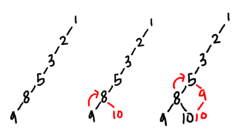

## DFS
---

완전 탐색의 대표적인 알고리즘은 DFS, BFS가 있다. 이 중에서 DFS를 이용해 완전 탐색을 할 경우에는 back tracking 알고리즘이 함께 사용되는 경우가 많다(BFS도 back tracking을 사용할 수 있지만 구조적으로 DFS를 기반으로 하는 것이 자연스러움). 따라서 여기에 제시되어 있는 code 중 대부분이 back tracking 내용을 함께 포함하고 있다

### DFS + back tracking 구조(base)

1 ~ 4 중 두 가지 수만 뽑는 경우

```Java
static void dfs(int index, int cnt, String ans) {
  if (cnt == n / 2) {
    System.out.print(ans);
    return;
  }
  for (int i = index; i <= n; i++) {
    visited[i] = true;  // 필요할 수도 있고, 그렇지 않을 수도 있음. 로또 문제에선 필요 없다
    dfs(i + 1, cnt + 1, ans + i + " ");
    visited[i] = false;   // 필요할 수도 있고, 그렇지 않을 수도 있음. 로또 문제에선 필요 없다
  }
}

static void main(String[] args) {
  Scanner sc = new Scanner(System.in);
  int n = sc.nextInt();
  dfs(1, 0, "");
}
```

### lotto 문제 back tracking



### 유형

부분 집합 찾는 경우(조합)

grid에서 조건 만족될 때 파고드는 경우
