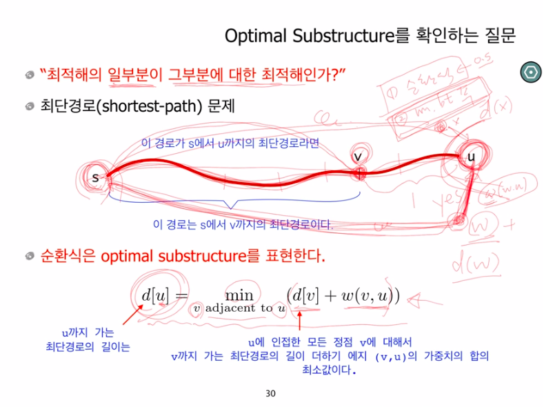

## Dynamic Programming
---

> 하위의 작은 문제들(subproblems)을 풀고, 이를 이용해서 더 큰 문제(original problem)를 풀어나가는 방법. 그런 의미에서 분할 정복법과 공통적 - obtimal structure
>
> 어떤 제한 조건이 주어졌을 때 무언가를 최적화하는 경우에 유용하다
>
> 하위 문제가 서로 의존하지 않는 경우에만 사용할 수 있다
>
> 답안에는 격자가 필요하다
>
> 격자의 각 칸에는 최적화하고자 하는 값을 적는다
>
> 각 칸은 원래 문제에 대한 하위 문제이다. 따라서 원래의 문제를 어떻게 하위 문제로 나눌 수 있을지 생각해야 한다
>
> 격자의 축을 생각한다
>
> 해답을 계산해주는 쉬운 공식은 없다. 직접 알아내야 한다

### 풀이 방법

* 일반적으로 최적화문제 혹은 카운팅 문제에 적용된다

* 주어진 문제에 대한 순환식을 정의한다(순환식으로 정의 될 수 있다면 DP로 해결) - 가장 중요

  

  bottom-up : 순환식에서 오른쪽 부분이 왼쪽 부분보다 먼저 계산 되는 순서를 의미한다

* 순환식을 memoization(top-down) 또는 bottom-up 방식으로 푼다 (크게는 둘 다 동적 계획법이지만, bottom-up만을 의미하는 경우도 있다. memoization을 쓰지 않고 recursion을 활용하면 시간 복잡도 기하급수적으로 늘어난다)
