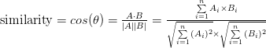

## KNN algorithm
---

> k - nearest neighbors

### 분류

데이터에는 몇 가지 특징이 있다. 여기서 특징을 추출하여 각 특징마다 값을 메기고, 새로 주어진 데이터의 특징 값들과의 유사도를 비교해 어느 그룹에 분류가 되는지 확인한다

가까운 이웃 데이터가 가장 많이 속하는 그룹이 새로운 데이터의 그룹이 된다

ex) 넷플릭스 영화 추천

### 회귀 분석(반응 예측)

새로운 데이터와 가장 비슷한 유사도를 갖는 데이터 k개를 찾는다. 그리고 그 데이터들의 평균 값을 통해 새로운 데이터의 값을 추측한다

### 유사도

유사도를 구하는 방법은 거리, 코사인 유사도 등등이 있다

* 거리

두 데이터 사이의 거리 : (Ax - Bx)^2 + (Ay - By)^2 + ...

하나의 데이터는 2차원 좌표 일 필요 없다

* 코사인 유사도

분자는 A벡터와 B벡터의 내적, 분모는 A벡터의 크기와 B벡터 크기의 곱

### 좋은 특징

* 카테고리와 직접적 관련 있는 특징

* 편향되지 않은 특징
