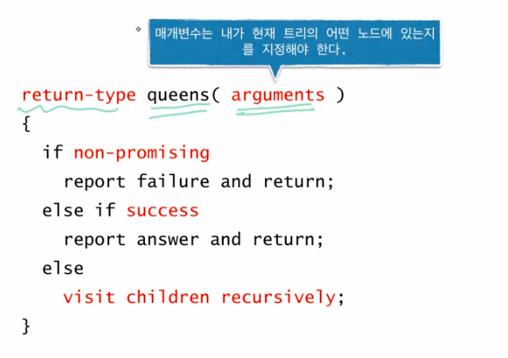
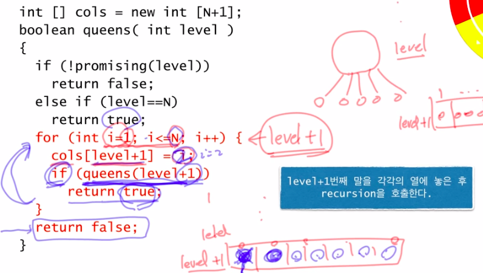
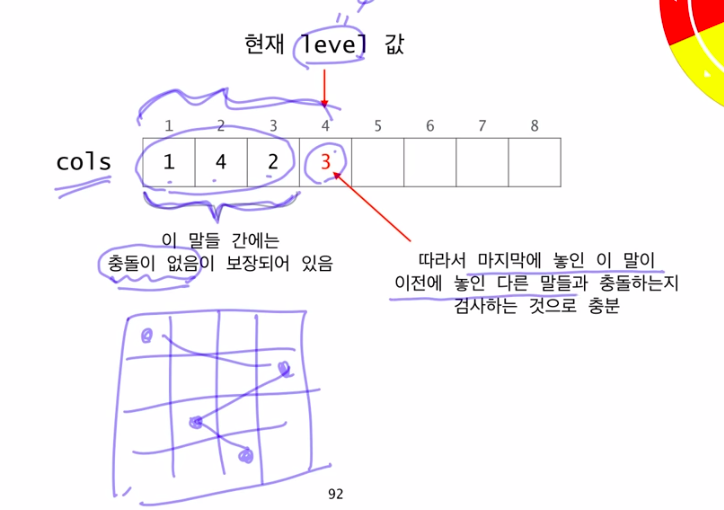
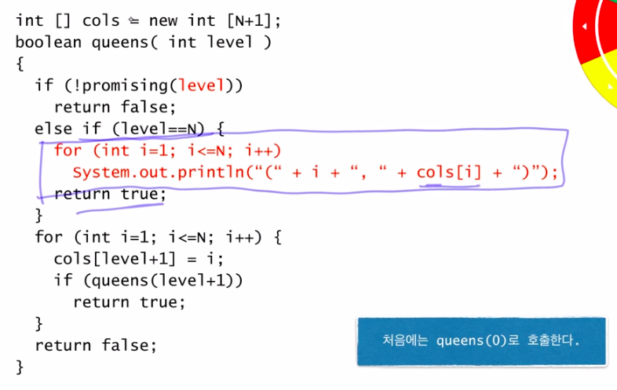

## n - Queens
---

> recursion을 이용해 Queen이 놓을 수 있는 경우 찾기
>
> Queen은 가로 세로 대각선 방향에 말 하나밖에 놓일 수 없다는 것이 원칙
>
> back tracking을 알아보기 위한 좋은 구조. 따라서 back tracking을 사용하고자 할 때 아래의 pseudocode를 기본으로 삼아 사용한다

### Pseudocode

1. 기본 틀

2. else 부분

3. promising check

4. 완성

